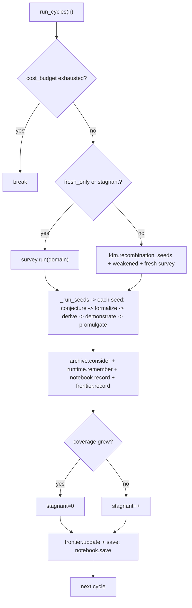

# Discovery Loop and Frontier Steering

`leibniz/daemon.py::Leibniz.run_cycles` is the open-ended discovery loop (ADR 0009). On each circadian cycle it turns the six-stage pipeline once, then re-seeds the next cycle from the KFM archive. ADR 0018 closes the loop on the **proposal** side — where the text is actually generated — by steering the conjecturer toward the band of the *novel-yet-tractable*. **Everything here is proposal-side and writes no trust edge**: the kernel and Z3 still decide; the trust boundary is untouched.

## The circadian cycle

`circadian_cycle()` runs one cycle: `survey.run(domain)` → `_run_seeds(seeds, report)`. `run_cycles(n, fresh_per_cycle, recombine_k, stagnation_limit)` turns N cycles:

*Figure: re-seed each cycle from KFM recombination + weakened near-misses + fresh survey. Stagnation for `stagnation_limit` cycles triggers a fresh SURVEY. The cost budget stops before exceeding `LEIBNIZ_DAILY_USD_CAP`.*

## The seeds of each cycle

`_next_seeds` composes the next cycle's seeds from three sources:

1. **KFM recombination** — `kfm.recombination_seeds(recombine_k)` — curiosity-biased parents, recombined pairwise (the 'fuck' edge). When the archive is cold (fewer than 2 elites), it falls back to a fresh SURVEY.
2. **Weakened near-misses** — `weakening_seeds(notebook.too_hard, weaken_k)` — turn UNPROVEN near-misses into strictly-weaker re-conjecture seeds (lemma mining), fed back through the same gated pipeline (ADR 0018 M3).
3. **Fresh survey** — `survey.run(domain)[:fresh_per_cycle]` — a few fresh frontier seeds each cycle.

`_blend_mined` (ADR 0034 Stage 2) **replaces** up to `mine_k` of the cycle's seeds with computed-pattern seeds (preserving the count, so a mining run's conjecture budget matches a no-mining run — a clean A/B on volume). The pattern miner (`leibniz/pattern_mining.py`) finds TRUE residue regularities of low-degree integer polynomials by computation over the integers; every mined pattern is exactly true (an integer polynomial is periodic mod m with period m, so the residue set over `[0, m)` is complete). It decides nothing — the seed still runs the full gates and the kernel.

`_seed_origin(seed)` classifies a seed by its producer's marker for provenance (ADR 0034 §5): `mined`, `weaken`, `kfm`, else `survey` — so the kill condition can isolate MINED-origin promulgations.

## The FrontierController (ADR 0018 M2)

`leibniz/discovery.py::FrontierController` is a thermostat that nudges a target **difficulty band** from the recent proof-success rate (a curriculum — ease off when nothing proves, push when everything is trivial). `difficulty(prop)` is a mechanical, pre-proof structural proxy in `[0,1]` (quantifier count, implication depth, operator density, length); no LLM. It tracks **provability** (did the kernel close it), not promulgation — a budget-refused but kernel-proved candidate is a tractable difficulty, not a miss.

## The DiscoveryNotebook (ADR 0018 M1 / ADR 0023)

`DiscoveryNotebook` is a bounded, rolling memory of recent outcomes distilled into a steering block: `proven` (emulate these), `too_hard` (weaken these), `avoid` (don't re-propose these), `genre_kill` (whole families repeatedly proved — the genre-hop unit), `exemplars` (curated novel-yet-elementary FLAVOUR anchors from `corpus/novelty_exemplars.json`). It persists across runs (`notebook_path`, ADR 0023) so weaken-and-retry keeps grinding the same UNPROVEN frontier toward a proof. `quality(prop)` grades stepping stones: a promulgated law is 1.0; a faithful-but-unproven near-miss is graded by closeness to a frontier difficulty (peak 0.45), strictly below a real proof.

## Resilience (ADR 0029)

`_run_seeds` wraps each seed in a try/except — a transient provider/infra failure on ONE seed must not crash a multi-cycle, hours-long run. `KeyboardInterrupt`/`SystemExit` are not `Exception`, so an operator Ctrl-C still stops the run. The kernel/trust path is untouched — a skipped seed simply yields no candidate.

See [Selection](../components/selection.md) for the archive and [Pipeline](pipeline.md) for the stages.
