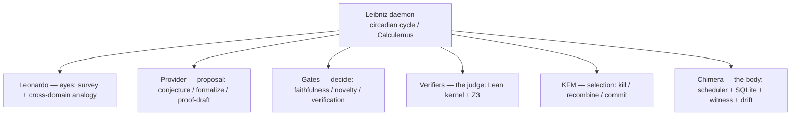
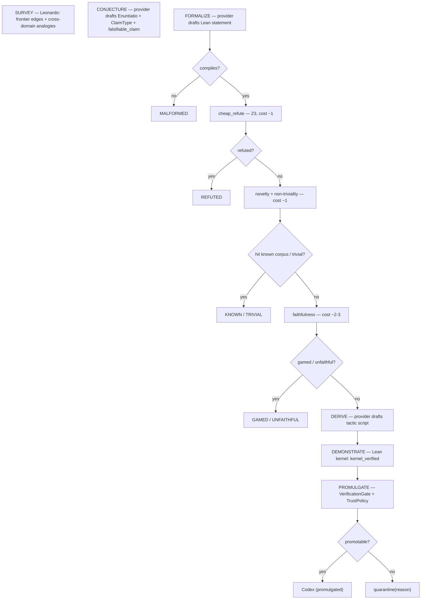

# Architecture Overview

Leibniz is an assembly of four extant systems plus one new organ, bound by a trust boundary. The central design inversion versus its predecessor *Newton* (`newton-daemon`): Newton *demonstrates* (runs a mutation-hardened acceptance test in a sandbox); Leibniz *calculates* (discharges a formal proof obligation against the Lean kernel). The `proof_obligation` seam Newton pre-wired and left dormant is active here.

## The organ map

*Figure: the five organs the daemon sequences, plus the runtime substrate. LLMs occupy only the proposal roles; the gates and kernel decide.*

- **Chimera (body)** — `leibniz.adapters.RuntimeAdapter`. Scheduling, SQLite persistence, the cross-model witness mechanism, drift/trust telemetry. Implemented by `leibniz.runtime.PersistentRuntime` (ADR 0016).
- **Newton (spine)** — `leibniz.pipeline`, `leibniz.propositio`. The six-stage loop and the Enuntiatio/Expressio/Demonstratio ledger, inherited wholesale; the Demonstratio backend is flipped from execution-gate to kernel proof.
- **KFM (selection)** — `leibniz.selection`. Kill / recombine / commit as a quality-diversity operator over a MAP-Elites archive.
- **Leonardo (eyes)** — `leibniz.leonardo.LeonardoForgeAdapter`. Cross-domain analogies from Leonardo's Codex folios, plus curated frontier survey.
- **Verification (the judge, NEW)** — `leibniz.verifiers`. Lean kernel + Z3. The organ Newton deliberately omitted.

## Data flow through one circadian cycle

*Figure: cheap-refutation-first ordering. Every cheaper edge short-circuits before the expensive proof compute at DEMONSTRATE.*

## Where the trust boundary sits

Everything left of DEMONSTRATE is **proposal** (LLM-permitted) or **cheap mechanical filtering**. The proof verdict at DEMONSTRATE is mechanical and sole-sourced from the kernel (`leibniz.verifiers.LeanVerifier.discharge` is the only writer of `Demonstratio.kernel_verified`). PROMULGATE renders no new judgment — it is a pure function of recorded evidence, checked against `TrustPolicy`. The only LLM judgment that can reach a promulgated law is an OPEN_FORM faithfulness fallback, and even that is logged and budget-bounded.

## What is deliberately not here

- No execution-gated "test passes ⇒ true" path (that is Newton).
- No empirical/symbolic-regression Demonstratio (different daemon, different ADR).
- No edge on which an LLM's say-so promotes a result.

See [Trust Boundary](trust-boundary.md), [Pipeline](pipeline.md), and [Trust Invariants](../trust-invariants.md) for the load-bearing details.
