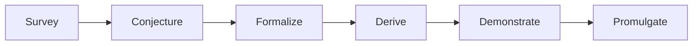

# Pipeline

The six-stage pipeline lives in `leibniz/pipeline.py` and is inherited from Newton's loop shape. Each stage is a small dataclass with one method. **Stages only ever advance a `Propositio` or quarantine it; the verdicts live in the gates and verifiers, never in the stages themselves.** This keeps the trust boundary legible: the stages move work; the gates decide (`leibniz/pipeline.py` module docstring).

*Figure: the six stages advance a Propositio; the cheap gates run inside FORMALIZE before DERIVE spends proof compute.*

## The Propositio triad (the unit of work and record)

`leibniz/propositio.py` defines the ledger triad inherited from Newton, with the Demonstratio backend deliberately inverted to kernel proof:

- **`Enuntiatio`** — the human-readable claim, the thing the public ledger is held accountable to. Carries `statement`, `claim_type`, `falsifiable_claim` (the explicit Popper refutation condition), and the structured faithfulness contract (`claim_domain`, `claim_property`).
- **`Expressio`** — the formal statement in the characteristica universalis (Lean 4). `theorem_src` is the statement only; the proof is the Demonstratio's job. Carries `imports`, `normalized_hash`, `established_domain`, and optional Walnut/proof-hint fields.
- **`Demonstratio`** — the proof obligation and its discharge. `kernel_verified` is the only field that may gate promotion, and only the kernel may set it `True` (in `leibniz.verifiers.LeanVerifier.discharge`). `seal()` stamps `Q.E.D.` iff `kernel_verified`, else `Q.E.I.`.

A `Propositio` carries the triad plus lineage (`parents`), a `ClaimSignature`, the accumulated `EdgeEvidence`, the `behavior_descriptor` KFM uses to place it in the archive, and `seed_origin` provenance (ADR 0034). Candidates are quarantined with a `FinishReason`, never deleted.

## The six stages

### 1. Survey (`Survey.run`)
The Leonardo seam: `LeonardoAdapter.survey_frontier(domain)` returns live edges of the domain, and for each edge `cross_domain_analogies` adds cross-domain stepping stones. Returns a list of seed strings.

### 2. Conjecture (`Conjecture.run`)
LLM-as-variation-operator. The provider proposes an `Enuntiatio` (parsed from structured JSON, ADR 0005) from a seed. Proposal only — the provider may draft, never decide. Records a `behavior_descriptor`.

### 3. Formalize (`Formalize.run`) — the cheap gates run inside
The autoformalizer drafts a Lean `Expressio`, then the stage runs the **cheap gates in order** before any proof compute:

1. **Compile** (`_compile_with_repair`) — with mechanical import-repair (ADR 0012) then bounded LLM statement repair (R4.2). Failure → `MALFORMED`.
2. **cheap_refute** (Z3, cost ~1) — a bounded counterexample search. A hit → `REFUTED`.
3. **novelty + non-triviality** (cost ~1) — a `KNOWN` or `TRIVIAL` hit kills the candidate.
4. **contract steering** (ADR 0022) — a bounded, mechanical repair of the structured faithfulness contract toward the sound DSL, committed only if strictly sound.
5. **faithfulness** (cost ~2-3) — the gaming-witness spine, then sound backends, then the claim-type probe, then the bounded JUDGE fallback. `GAMED` / `UNFAITHFUL` / `DEFER` → no proof compute.

Only survivors return from `Formalize.run`.

### 4. Derive (`Derive.run`)
The expensive stage: the provider drafts a tactic script (`Role.PROOF_DRAFT`). In the production assembly this is replaced by `NoOpDerive` — proof drafting moves into `ConsensusDemonstrate`'s ensemble (ADR 0006).

### 5. Demonstrate (`Demonstrate.run`)
The kernel check. `LeanVerifier.discharge` is the sole writer of `kernel_verified`. In production, `ConsensusDemonstrate` runs the cascade/witness prover ensemble under N+1 consensus, or `RepairingDemonstrate` adds the agentic repair loop (ADR 0029), or `DecomposingDemonstrate` adds independent lemma decomposition (ADR 0027).

### 6. Promulgate (`Promulgate.run`)
Commit to the Codex iff `VerificationGate.is_promotable` is `True`; else quarantine with `UNPROVEN` (if no gate already set a reason). **Promotion is not publication** — a separate operator-tier action moves Codex → public (`leibniz.calculemus.Calculemus.publish`).

## Cheap-refutation-first ordering

The ordering is realized by FORMALIZE running the SMT cheap-refute and the novelty/non-triviality gate *before* DERIVE spends proof compute, and by DEMONSTRATE running the faithfulness gate (in FORMALIZE) before sealing. The `cost_units` on each `EdgeEvidence` drives this (1 for refutation/novelty, 2-3 for faithfulness, 10 for proof). See [Trust Boundary](trust-boundary.md) for the tier rules and [Discovery Loop](discovery-loop.md) for how the daemon closes the loop across cycles.
