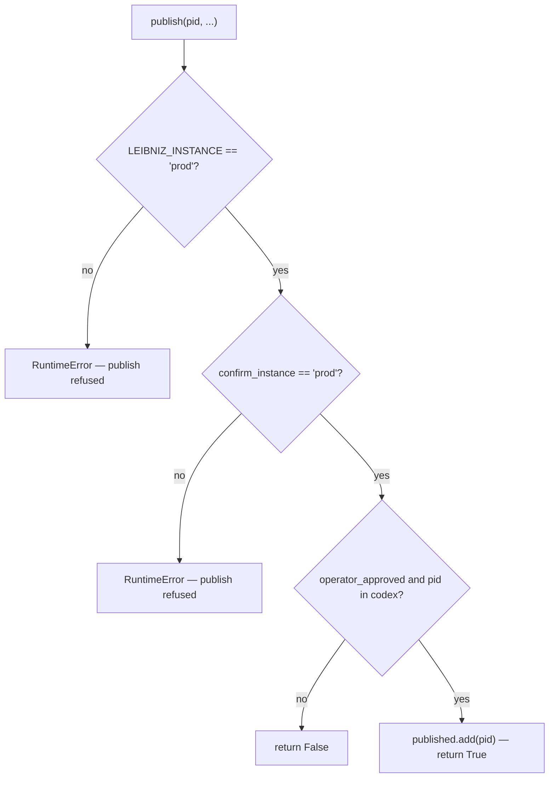

# Calculemus and the Publish Tier

`leibniz/calculemus.py` is the public reading-room (R6) — the ledger of theorems settled by calculation. The daemon **promulgates** kernel-checked laws to the Codex; **promotion is not publication** — a law only reaches the public *Calculemus* ledger after an explicit operator action (ADR 0008).

## The Codex vs the published set

`Calculemus` holds two collections:

- `codex: dict[pid, Propositio]` — the promulgated laws (kernel-checked).
- `published: set[pid]` — the subset an operator promoted to the public ledger.

`promulgate(prop)` admits a law to the Codex **only if** it carries a real kernel `Q.E.D.` — it checks `prop.promulgated and demo.kernel_verified and demo.qed == "Q.E.D."`. It never hand-sets the certificate; it reads `Demonstratio.qed`/`kernel_verified` set by `discharge`/`seal` (invariant 7).

`render_propositio(prop)` renders one promulgated law as a folio: the `Enuntiatio` (statement, claim type, falsifiable claim), the `Expressio` (Lean source), the `Demonstratio` (kernel-checked proof), and the `Q.E.D.`/`kernel_verified` certificate.

## The publish gate (ADR 0033)

`publish(pid, operator_approved, confirm_instance)` promotes a Codex law to the public ledger. The guard is **additive, never weaker** (ADR 0033 invariant #3):

*Figure: only the PROD instance may publish, and only with an explicit operator approval + instance confirmation. The publish can never happen by default or from a UAT/dev process.*

`colophon()` reports what is held back and why — the promulgated laws awaiting operator publication, with the running instance so provenance is visible.

## The site bridge

`leibniz/calculemus_site.py` bridges the in-memory `Calculemus` to the Astro static site at [codexcalculemus.com](https://codexcalculemus.com). It is **read-only over the ledger**: it reads operator-published laws and the held-back Codex and emits the JSON the site's `sync-ledger.mjs` consumes. It writes no `kernel_verified`, no `promulgated`, mints no edge — it only reports what `Calculemus` already decided. `scripts/export_calculemus.py` serializes and kernel-re-verifies the ledger (ADR 0017).

## Law provenance (ADR 0050)

`law_payload(prop, tier, origination, references)` adds two **report-only** provenance attributes (never consulted by the trust gates, `kernel_verified`, or `promulgate`):

- `tier` ∈ {`kernel-decided`, `exact-procedure`, `cross-kernel`} — the confidence ladder (ADRs 0045/0048).
- `origination` ∈ {`originated`, `amplified`} — a fact the daemon originated vs a re-decision of published work. An `amplified` law **must** cite its source (`references`); an `originated` law asserts a fact no cited source states.

See [Instance Isolation](../instance-isolation.md) for the prod/uat/dev split and `leibniz/instance_config.py` for the per-instance pinned Lean image and corpus.
