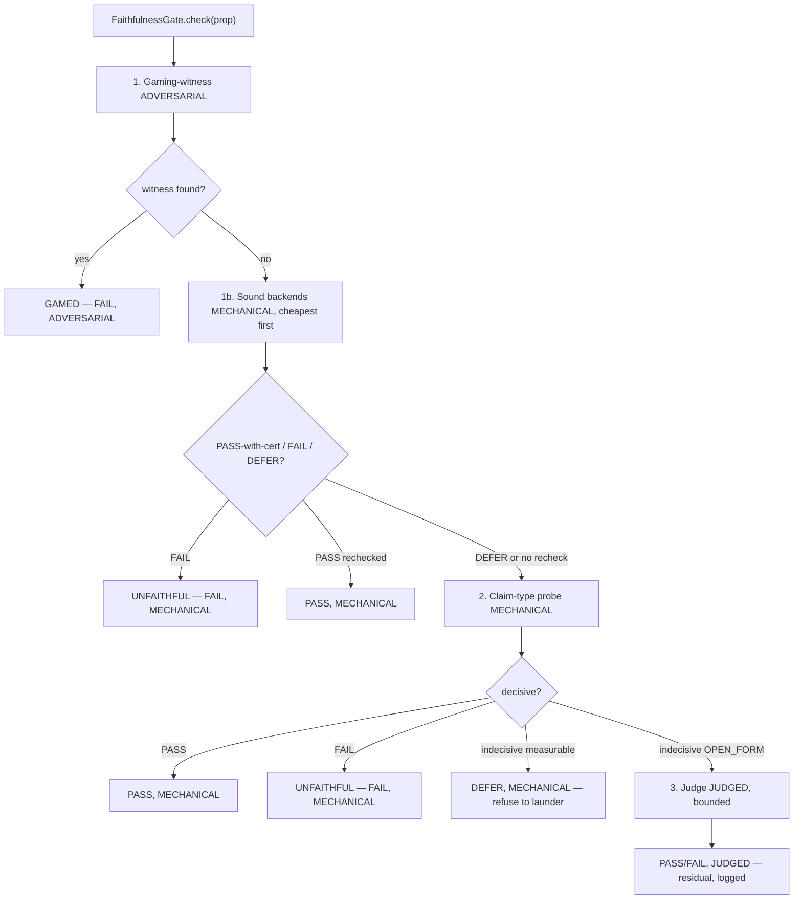

# Faithfulness Gate

`leibniz/gates/faithfulness.py::FaithfulnessGate` handles the one irreducible residual of a proof-bearing system. The Lean kernel guarantees proof ↔ statement; **nothing guarantees statement ↔ Enuntiatio** (the human-readable claim). A kernel-valid proof of a *mis-stated* theorem is strictly worse than no proof — most authoritative exactly when most wrong, and a public ledger makes it permanent. This is the 3-body faithfulness problem (ADR 0001/0002).

A naive gate ("ask an LLM whether the statement matches the claim") is theater: the judge shares the formalizer's blind spots and rubber-stamps. So the gate tries **strongest first**:

*Figure: the strongest-first ladder. The LLM judge is reached only when every sound backend and the probe decline.*

## The ladder

1. **Adversarial spine (gaming-witness)** — `ADVERSARIAL`. Try to satisfy the formal statement while *violating* the Enuntiatio. If such a witness exists, the statement underspecifies the claim → `GAMED` (FAIL, tier `ADVERSARIAL`, producer `SMTVerifier.gaming_witness`). When the claim carries a structured contract (`claim_domain`, `claim_property`, `established_domain`), the search targets the real gaming target; otherwise it falls back to the prose `falsifiable_claim`.

2. **Sound backends (ADR 0037)** — `MECHANICAL`. Additional exact-or-DEFER checkers (Walnut, SOS, kernel bridge), run cheapest-first. Each is exact-or-DEFER with a **re-checked certificate** — the gate's own `CertificateRechecker` independently re-verifies the certificate kind (automaton-universality for Walnut, `ring` for SOS, the kernel for a bridge). A PASS with no registered re-checker, or one whose re-check fails, is **not** a pass (downgraded to fall-through). DEFER never becomes PASS.

3. **Claim-type probe (MECHANICAL fast path)** — dispatched by `ClaimType`. A decisive probe returns PASS or FAIL (`UNFAITHFUL`); an indecisive *measurable* claim returns **DEFER** (refuse to launder it through a judge), not a pass.

4. **Judge (JUDGED fallback)** — only for `ClaimType.OPEN_FORM` claims that resist operationalization. Round-trip back-translation + independent review, `confidence >= judge_threshold` (0.9). Logged, tier `JUDGED`, `producer=JUDGE_PRODUCER`. The bounded residual tracked by `TrustBudget`.

## Why the structure holds

- The gaming spine is **generative** — it catches gaps a concordance judge waves through.
- Sound backends are **mechanical, never a judge** — the LLM judge stays exactly where it is, reached only when every sound backend DEFERs.
- A measurable claim with no decisive probe is a **DEFER, not a pass** — the gate refuses to launder it through a judge (the contract steering in `Formalize._steer_contract` tries to make the contract encodable first, ADR 0022).
- The producers are pinned: `SMTVerifier.gaming_witness`, `ClaimProbe`, `FaithfulnessGate`, and the sound backends' producers are in `FAITHFULNESS_PRODUCERS`; the judge is `JUDGE_PRODUCER`. A MECHANICAL faithfulness edge from a producer outside the allowlist is rejected (ADR 0041).

See [Trust Boundary](../architecture/trust-boundary.md) for the budget that bounds the judged residual and [Sound Backends](sound-backends.md) for the Walnut/Observatory tier.
