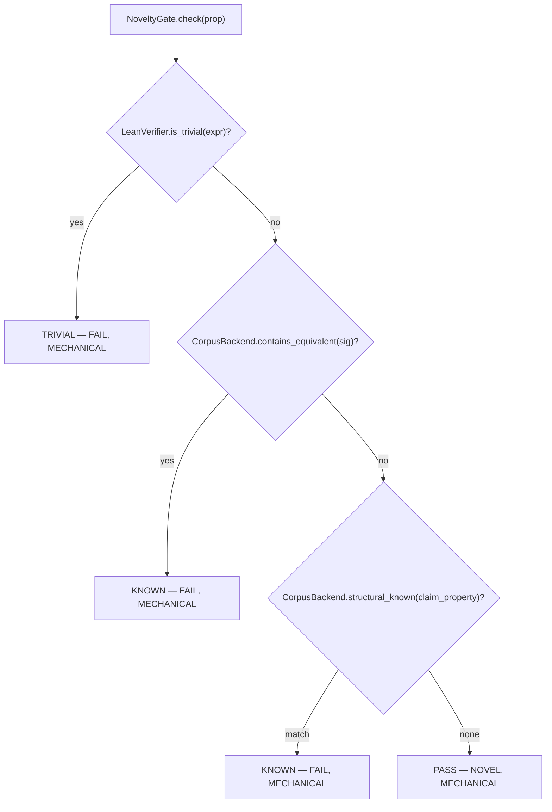

# Novelty Gate and Corpus

`leibniz/gates/novelty.py::NoveltyGate` fixes Newton's real second gap. Newton's dedup was internal and offline (difflib against its own Codex), so it triumphantly rediscovered textbook theorems. Here novelty is a **promotion gate** with two mechanical parts (ADR 0001): novelty is settled by **retrieval + a decision procedure, never an LLM judge**.

## The gate

*Figure: non-triviality first (cheapest), then exact-hash dedup, then structural congruence. Unrecognized shapes stay NOVEL.*

1. **Non-triviality** (cheapest) — `LeanVerifier.is_trivial(expr)`: a statement an automated tactic (`decide`/`simp`/`omega`/`trivial`/`aesop`/`ring`/`nlinarith`) closes on its own is vacuous → `TRIVIAL`. This is the `aesop` test from LeanConjecturer (the convergent-evolution twin of Newton's "teeth"). `producer="LeanVerifier.is_trivial"`.
2. **External dedup (exact hash)** — `CorpusBackend.contains_equivalent(sig)`: True iff the candidate's elaborator-canonical `formal_hash` (R1c) equals a known entry's — the same theorem up to alpha-renaming and notation → `KNOWN`. `producer="CorpusBackend"`.
3. **Structural congruence (ADR 0032)** — `structural_known(claim_property)`: the name of a curated known whose polynomial congruence is structurally **identical by FORM** (via `leibniz/structural.py::congruence_signature`), or None. Catches restatements the exact hash misses (`(n^5+4n)%5==0` vs Fermat `n^5%5==n%5`) by FORM, not truth — so it cannot false-KNOWN (a different congruence has a different signature). `producer="CorpusBackend.structural_known"`.

A PASS is `producer="NoveltyGate"`. The `SMTVerifier` is accepted for back-compat but unused (ADR 0031 L2 retracted).

## The corpus

`leibniz/corpus.py::CorpusBackend` loads `corpus/known_results.json` (built by `scripts/build_corpus.py`) and settles novelty by structure:

- `contains_equivalent(sig)` — exact `formal_hash` match (the same theorem up to alpha-renaming/notation). An empty/absent hash never matches (a candidate we couldn't normalize is treated as novel, not silently KNOWN).
- `structural_known(claim_property)` — the structural-congruence match (ADR 0032), keyed by `congruence_signature` of the predicate.
- `nearest(sig, k=5)` — known entries sharing subject/relation/type as **informational** neighbours (scored 1.0 exact, +0.5 subject, +0.3 relation, +0.2 type), not a promotion signal.

Runtime queries need no Lean: the entries' hashes are precomputed at build time, so this is a pure hash/signature comparison (CI-safe). `leibniz/novelty_metrics.py` is a **read-only** structural-diversity tripwire (ADR 0034 Stage 0) — it computes numbers, it decides nothing; the sole novelty arbiter stays the gate.

## Why truth-equivalence was retracted (ADR 0031 L2)

ADR 0031 Layer 2 tried to catch restatements by Z3 *truth*-equivalence and was retracted as unsound: every theorem's claim is a tautology over its domain, so all true claims were mutually equivalent and any always-true known matched everything. ADR 0032 decides on **FORM instead** — the signature is the polynomial-congruence form, never its truth. See [Trust Boundary](../architecture/trust-boundary.md) for why novelty must never be settled by a judge.
