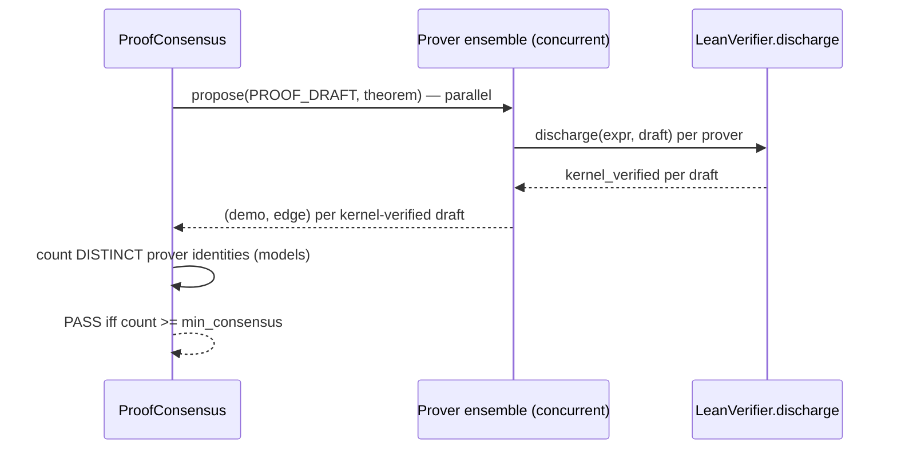

# Proof Consensus and Repair

`leibniz/consensus.py` and `leibniz/proof_repair.py` strengthen the proof edge — they never weaken it. The Lean kernel is still the sole decider: every prover draft is checked by `LeanVerifier.discharge`. Consensus only **adds a requirement** — promulgation needs `min_consensus` *distinct* kernel-verified proofs from independent provers (ADR 0006).

## N+1 kernel-verified consensus

`ProofConsensus` is an ordered ensemble of provers (cheap → expensive, plus cross-model witnesses). Each drafts a proof of the **same** statement; the recorded `PROOF_EDGE` PASSes only when ≥ `min_consensus` drafts each pass the kernel (default `min_consensus=2`, i.e. N+1 with N=1).



*Figure: each draft is independently kernel-checked. Consensus counts DISTINCT prover identities (models), not raw passing attempts — a single model can never self-satisfy the threshold.*

Key points:

- **`_prover_identity(prover)`** — unwraps strategy wrappers (e.g. `DecompositionProver`, which only reshapes the prompt) to the underlying base, then keys on the model name. One model is one voter, however many strategies it runs (ADR 0024).
- **Concurrent** — `max_workers` (default 4) runs the ensemble in parallel (I/O-bound), each attempt a stateless docker run, thread-safe.
- **`normalize_proof(text)`** — strips markdown fences and any leading restated `theorem … :=` so a correct proof isn't rejected on formatting. Only strips KNOWN fence languages (`""`, `lean`, `lean4`), never a bare tactic line.
- The recorded PASS edge is a **real** `discharge` edge (MECHANICAL, `producer=KERNEL_PRODUCER`), annotated with the consensus count.

`NoOpDerive` and `ConsensusDemonstrate` are the production DERIVE/DEMONSTRATE stages: `NoOpDerive` advances the survivor (proof drafting moves into the ensemble), `ConsensusDemonstrate` runs `consensus.prove` and attaches a kernel-verified `Demonstratio` when consensus is reached (else an unverified one for the record).

## Agentic proof repair (ADR 0029)

`leibniz/proof_repair.py::ProofRepairer` turns a single draft into a conversation: it feeds the kernel's actual complaint (`check_proof_with_error`) back to a frontier reasoner and lets it try again, a few bounded rounds (`max_rounds=2`). The measured bottleneck is prover **reach** on non-trivial goals — the ensemble drafts, the kernel rejects, and that is the end. Repair closes that gap.

Trust boundary **unchanged** (CLAUDE.md invariants 1, 2, 7):

- The reasoner only **proposes**. `discharge` remains the sole writer of `kernel_verified`; the loop's own `check_proof_with_error` calls are advisory (they surface the error to repair against; `discharge` re-checks any candidate before stamping).
- **N+1 is preserved, not bypassed.** Repair runs only when the normal ensemble comes up short; a repaired proof counts as exactly one more *distinct* prover identity (canonicalized by `_canonical_model`, which reduces `repair:<model>` and `model:<model>` to the bare name — so a repair by a model already in the base is not a second voter). It promulgates only if `len(distinct base verifiers) + len(distinct panel closers) >= min_consensus`. A single repaired proof never self-satisfies at N+1=2.
- **The statement is fixed.** `repair_proof` is prompted to change only the PROOF, never the theorem; and the kernel checks `theorem_src := proof` — a repaired body that "proves" a different claim fails to elaborate.

`RepairingDemonstrate` composes the fallback ladder at the `ConsensusResult` level (so a candidate never carries both a FAIL and a PASS proof edge):

```
N+1 consensus  →  (optional) ADR 0027 decomposition  →  ADR 0029 repair panel
```

The repair panel is `[repairer, *panel]` — independent reasoners each running their own draft→repair loop. With an empty panel this is exactly the single-reasoner v1 behaviour.

## Independent lemma decomposition (ADR 0027)

`leibniz/lemma_decomposition.py::LemmaDecomposer` asks a provider to decompose a hard theorem into helper lemmas, prove each independently through the existing N+1 consensus, then re-prove the main with the proven lemmas offered as `have`-block **hints** to the prover. **Soundness by construction**: the hints are prover context, never placed in the Lean source the kernel checks; the composed proof is `theorem_src := <prover proof>` (the prover may paste the `have`s into its own `by` block, where the kernel re-verifies each). There is no separate top-level declaration before the main, so nothing a smuggled `axiom`/`attribute`/`notation`/`run_cmd` could poison.

See [Verifiers](verifiers.md) for the kernel seam and [Discovery Loop](../architecture/discovery-loop.md) for how the daemon sequences these across cycles.
