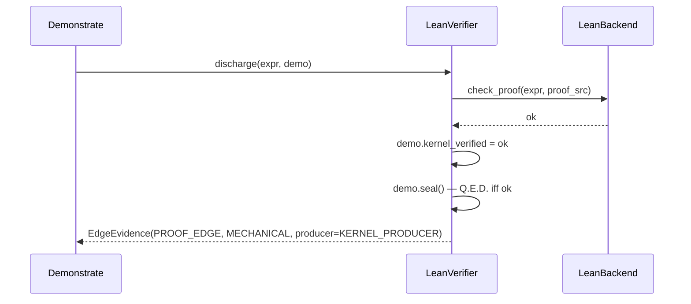

# Verifiers

`leibniz/verifiers.py` defines the two components allowed to render MECHANICAL verdicts. Both are **seams**: the integration with LeanDojo or a real Z3 build is a clearly-marked adapter so the architecture can be exercised end-to-end with deterministic fakes first.

## LeanVerifier — the proof kernel

The sole arbiter of the proof↔statement edge. `LeanBackend` is a `Protocol` that must provide `compile_statement`, `check_proof`, and `closed_by_decision_procedure`.

*Figure: `discharge` is the ONLY place `kernel_verified` is set. The edge is always MECHANICAL and produced by `KERNEL_PRODUCER` ("LeanVerifier.discharge").*

- `validate_statement(expr)` — syntactic validity (free: it compiles or it does not); sets `expr.compiles` and `normalized_hash`.
- `discharge(expr, demo)` — checks the proof. `ok = bool(demo.proof_src) and backend.check_proof(expr, proof_src)`, sets `demo.kernel_verified`, calls `demo.seal()`, returns the `PROOF_EDGE` `EdgeEvidence` with `producer=KERNEL_PRODUCER`. `cost_units=10.0` (proof search is the expensive edge).
- `is_trivial(expr)` — non-triviality mechanized: a statement an automated tactic (`decide`/`simp`/`omega`/`trivial`/`aesop`/`ring`/`nlinarith`) closes on its own is vacuous.

`normalize_statement(theorem_src)` is the textual-hash fallback for structural hashing; the elaborator-canonical hash (R1c, de Bruijn indices + fully-qualified constants) lives in `LeanCliBackend.normalize_statement` and is what the novelty corpus keys on.

## SMTVerifier — Z3, kill-only

Two uses, both only **kill** (never promote):

- `cheap_refute(falsifiable_claim, bound=64)` — a bounded counterexample search before proof. PASS means "survived refutation", not "proven". `cost_units=1.0`. A counterexample → `REFUTED`.
- Used by the faithfulness gate's `find_gaming_witness` (the adversarial spine). A model (a witness that satisfies the statement while violating the claim) → `GAMED`.

`SMTBackend` is a `Protocol` providing `find_counterexample(claim, bound)` and `find_gaming_witness(statement, negated_claim, bound)`.

## The backends

The real implementations live in `leibniz/backends/`:

| Backend | Module | What it does |
|---|---|---|
| `LeanCliBackend` | `leibniz/backends/lean_cli.py` | R1: shells out to `lake env lean <file>` inside `leibniz-lean:v4.34.0-rc2` (Docker). `check_proof` returns True iff the file elaborates with no error diagnostics AND uses no `sorry`/`sorryAx`. Provides the R1c elaborator-canonical `normalize_statement` and a `persistent=True` mode (one container, `docker exec` per check). |
| `lean_repl` | `leibniz/backends/lean_repl.py` | The long-running Lean REPL (`check_proof_with_error`) used by the proof-repair loop to surface kernel errors. |
| `Z3Backend` | `leibniz/backends/smt_z3.py` | Z3 over a sound arithmetic predicate DSL (ADR 0021/0035); `decide_unsat` is tri-state (True iff conclusively UNSAT). |
| `WalnutBackend` | `leibniz/backends/walnut.py` | Walnut — FO over k-automatic sequences, sound over unbounded n (ADR 0037/0038). |

See [Faithfulness Gate](faithfulness-gate.md) for how the gaming-witness and sound backends compose, and [Proof Consensus](proof-consensus.md) for the N+1 ensemble that wraps `discharge`.
